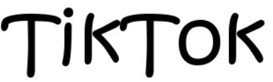

# tiktok

<!-- PROJECT SHIELDS -->


[![MIT License][license-shield]][license-url]


<!-- PROJECT LOGO -->
<br />

<p align="center">
  <a href="https://github.com/HammerCloth/tiktok.git/">
    
  </a>

<h3 align="center">抖音简洁版</h3>
  <p align="center">
    xxxxxxxxxxx(写这个版本的框架)
    <br />
    <a href="https://github.com/HammerCloth/tiktok.git"><strong>探索本项目的文档 »</strong></a>
    <br />
    <br />
    <a href="https://github.com/HammerCloth/tiktok.git">查看Demo</a>
    ·
    <a href="https://github.com/HammerCloth/tiktok.git">报告Bug</a>
    ·
    <a href="https://github.com/HammerCloth/tiktok.git">提出新特性</a>
  </p>
  </p>

## 目录

- [上手指南](#上手指南)
    - [开发前的配置要求](#开发前的配置要求)
    - [安装步骤](#安装步骤)
- [文件目录说明](#文件目录说明)
- [开发的架构](#开发的架构)
- [部署](#部署)
- [使用到的框架](#使用到的框架)
    - [如何参与开源项目](#如何参与开源项目)
- [版本控制](#版本控制)
- [贡献者](#贡献者)
- [鸣谢](#鸣谢)

### 上手指南


###### 开发前的配置要求

1. go 1.18.1环境（详细写？go build配置等？go mod内容中的构件？
2. MySQL，安装配置说明: https://dev.mysql.com/doc/mysql-installation-excerpt/8.0/en/
3. redis


###### **安装步骤**

1. Get a free API Key at [https://example.com](https://example.com)
2. Clone the repo

```sh
git clone https://github.com/HammerCloth/tiktok.git
```

### 文件目录说明

```
tiktok 
├── /.idea/
├── /config/
│  └── config.go
├── /controller/
│  ├── commentController.go
│  ├── followController.go
│  ├── likeController.go
│  ├── userController.go
│  └── videoController.go
├── /dao/
│  ├── commentDao.go
│  ├── commentDao_test.go
│  ├── followDao.go
│  ├── followDao_test.go
│  ├── likeDao.go
│  ├── likeDao_test.go
│  ├── userDao.go
│  ├── userDao_test.go
│  ├── videoDao.go
│  └── videoDao_test.go
├── /images/
├── /middleware/
│  ├── auth.go
│  ├── authBody.go
│  ├── commentMQ.go
│  ├── ffmpeg.go
│  ├── followMQ.go
│  ├── likeMQ.go
│  ├── rabbitMQ.go
│  └── redis.go
├── /service/
│  ├── commentService.go
│  ├── commentServiceImpl.go
│  ├── commentServiceImpl_test.go
│  ├── commentSub.go
│  ├── followService.go
│  ├── followServiceImpl.go
│  ├── followServiceImpl_test.go
│  ├── followSub.go
│  ├── likeService.go
│  ├── likeServiceImpl.go
│  ├── likeServiceImpl_test.go
│  ├── likeSub.go
│  ├── videoService.go
│  ├── videoServiceImpl.go
│  ├── videoServiceImpl_test.go
│  └── videoSub.go
├── .gitignore
├── /go.mod/
│  └── go.sum
├── LICENSE
├── main.go
├── README.md
└── router.go
```


### 开发的整体架构图

请阅读[ARCHITECTURE.md](https://github.com/shaojintian/Best_README_template/blob/master/ARCHITECTURE.md) 查阅为该项目的架构。

### 部署

```shell
CGO_ENABLED=0 GOOS=linux GOARCH=amd64 go build ./
```

### 使用到的框架

- [gin](https://getbootstrap.com)
- [xxxxxxx](https://jquery.com)
- [xxxxxxx](https://laravel.com)


#### 如何参与开源项目

贡献使开源社区成为一个学习、激励和创造的绝佳场所。你所作的任何贡献都是**非常感谢**的。

1. Fork the Project
2. Create your Feature Branch (`git checkout -b feature/AmazingFeature`)
3. Commit your Changes (`git commit -m 'Add some AmazingFeature'`)
4. Push to the Branch (`git push origin feature/AmazingFeature`)
5. Open a Pull Request

### 版本控制

该项目使用Git进行版本管理。您可以在repository参看当前可用版本。

### 贡献者
- 司一雄 邮箱:18552541076@163.com
- 刘宗舟 邮箱:1245314855@qq.com
- 蒋宇栋 邮箱:jiangyudong123@qq.com
- 李思源 邮箱:yuanlaisini_002@qq.com
- 李林森 邮箱:1412837463@qq.com

*您也可以查阅仓库为该项目做出贡献的开发者。*

### 版权说明

该项目签署了MIT 授权许可，详情请参阅 [LICENSE.txt](https://github.com/shaojintian/Best_README_template/blob/master/LICENSE.txt)

### 鸣谢

- [字节跳动后端青训营](https://youthcamp.bytedance.com/)

<!-- links -->

[license-shield]: https://img.shields.io/github/license/mrxuexi/tiktok.svg?style=flat-square

[license-url]: https://github.com/mrxuexi/tiktok/blob/master/LICENSE.txt