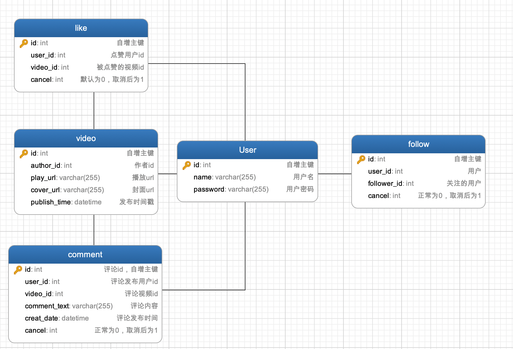

# tiktok

<!-- PROJECT SHIELDS -->


[![MIT License][license-shield]][license-url]


<!-- PROJECT LOGO -->
<br />

<p align="center">
  <a href="https://github.com/HammerCloth/tiktok.git/">
    
  </a>

<h3 align="center">抖音简洁版</h3>
  <p align="center">
    xxxxxxxxxxx(写这个版本的框架)
    <br />
    <a href="https://github.com/HammerCloth/tiktok.git"><strong>探索本项目的文档 »</strong></a>
    <br />
    <br />
  </p>
  </p>

**Attention:** We always welcome contributors to the project. Before adding your contribution, please carefully read our [Git 分支管理规范](https://ypbg9olvt2.feishu.cn/docs/doccnTMRmh7YgMwL2PgZ5moWUsd)和[注释规范](https://juejin.cn/post/7096881555246678046)。

## 目录

- [上手指南](#上手指南)
    - [开发前的配置要求](#开发前的配置要求)
    - [安装步骤](#安装步骤)
    - [演示界面](#演示界面)
    - [演示视频](#演示视频)
- [文件目录说明](#文件目录说明)
- [开发的整体设计](#开发的整体设计)
   - [整体的架构图](#整体的架构图)
   - [数据库的设计](#数据库的设计)
   - [服务模块的设计](#服务模块的设计)
     - [视频模块设计](#视频模块的设计)
     - [点赞模块设计](#点赞模块设计)
     - [关注模块设计](#关注模块设计)
     - [用户模块设计](#用户模块设计)
     - [评论模块设计](#评论模块设计)
- [性能测试](#性能测试)
- [部署](#部署)
- [使用到的技术](#使用到的技术)
- [如何参与开源项目](#如何参与开源项目)
- [版本控制](#版本控制)
- [贡献者](#贡献者)
- [鸣谢](#鸣谢)

### 上手指南

#### 开发前的配置要求

1. go 1.18.1环境（详细写？go build配置等？go mod内容中的构件？
2. MySQL，安装配置说明: https://dev.mysql.com/doc/mysql-installation-excerpt/8.0/en/
3. redis
4. [最新版抖音客户端软件](https://pan.baidu.com/s/1kXjvYWH12uhvFBARRMBCGg?pwd=6cos)
5. 

#### 安装步骤

1. Get a free API Key at [https://example.com](https://example.com)
2. Clone the repo

```sh
git clone https://github.com/HammerCloth/tiktok.git
```
#### 演示界面
**基础功能演示**

<a href="https://github.com/HammerCloth/tiktok.git/">
    
    
    
    
</a>

**拓展功能演示**

<a href="https://github.com/HammerCloth/tiktok.git/">
    
    
    
    
</a>

**设置服务端地址**

<a href="https://github.com/HammerCloth/tiktok.git/">
    
    
    
</a>

#### 演示视频
[](http://43.138.25.60/19417075-530f-4d55-bfc9-634b2306a8ab.mp4)

### 文件目录说明

```
tiktok 
├── /.idea/
├── /config/
├── /controller/
├── /dao/
├── /images/
├── /middleware/
├── /service/
├── .gitignore
├── /go.mod/
├── LICENSE
├── main.go
├── README.md
└── router.go
```

### 开发的整体设计
#### 整体的架构图

#### 数据库的设计
<p align="center">
  <a href="https://github.com/HammerCloth/tiktok.git/">
    
  </a>
</p>

#### 服务模块的设计

###### 视频模块的设计
视频模块包括视频Feed流获取、视频投稿和获取用户投稿列表。
详情请阅读[视频模块设计说明](https://bytedancecampus1.feishu.cn/docs/doccntmcunjHSMzVUNEhGbxjxJh) 查阅为该模块的详细设计。

###### 点赞模块的设计
点赞模块包括点赞视频、取消赞视频和获取点赞列表。
详情请阅读[点赞模块设计说明](https://bytedancecampus1.feishu.cn/docs/doccn13iJgTIAebIPpMiRqb0Hwb) 查阅为该模块的详细设计。

###### 关注模块的设计
关注模块包括关注、取关、获取关注列表、获取粉丝列表四个基本功能。
详情请阅读[关注模块的设计说明](https://bytedancecampus1.feishu.cn/docs/doccnOsdm29SufPJkDfRs7tLHgx) 查阅为该模块的详细设计。

###### 用户模块的设计
用户与安全模块包括用户注册、用户登录和用户信息三个部分
详情请阅读[用户模块的设计说明](https://bytedancecampus1.feishu.cn/docs/doccn1vusmV9oN1ukTCyLpbJ46f) 查阅为该模块的详细设计。

###### 评论模块的设计
评论模块包括发表评论、删除评论和查看评论。
详情阅读[评论模块的设计说明](https://bytedancecampus1.feishu.cn/docs/doccnDqfcZJW4tTD409NGlYfvCb) 查阅为该模块的详细设计。

### 性能测试

### 部署

```shell
CGO_ENABLED=0 GOOS=linux GOARCH=amd64 go build ./
```

### 使用到的技术

- [GIN](https://gin-gonic.com/docs/)
- [MySQL](https://dev.mysql.com/doc/)
- [Redis](https://redis.io/docs/)
- [RabbitMQ](https://www.rabbitmq.com/documentation.html)

### 如何参与开源项目

贡献使开源社区成为一个学习、激励和创造的绝佳场所。你所作的任何贡献都是**非常感谢**的。

1. Fork the Project
2. Create your Feature Branch (`git checkout -b feature/AmazingFeature`)
3. Commit your Changes (`git commit -m 'Add some AmazingFeature'`)
4. Push to the Branch (`git push origin feature/AmazingFeature`)
5. Open a Pull Request

### 版本控制

该项目使用Git进行版本管理。您可以在repository参看当前可用版本。

### 贡献者
- 司一雄 邮箱:18552541076@163.com
- 刘宗舟 邮箱:1245314855@qq.com
- 蒋宇栋 邮箱:jiangyudong123@qq.com
- 李思源 邮箱:yuanlaisini_002@qq.com
- 李林森 邮箱:1412837463@qq.com

*您也可以查阅仓库为该项目做出贡献的开发者。*

### 版权说明

该项目签署了MIT 授权许可，详情请参阅 [LICENSE.txt](https://github.com/shaojintian/Best_README_template/blob/master/LICENSE.txt)

### 鸣谢

- [字节跳动后端青训营](https://youthcamp.bytedance.com/)

<!-- links -->

[license-shield]: https://img.shields.io/github/license/mrxuexi/tiktok.svg?style=flat-square

[license-url]: https://github.com/mrxuexi/tiktok/blob/master/LICENSE.txt